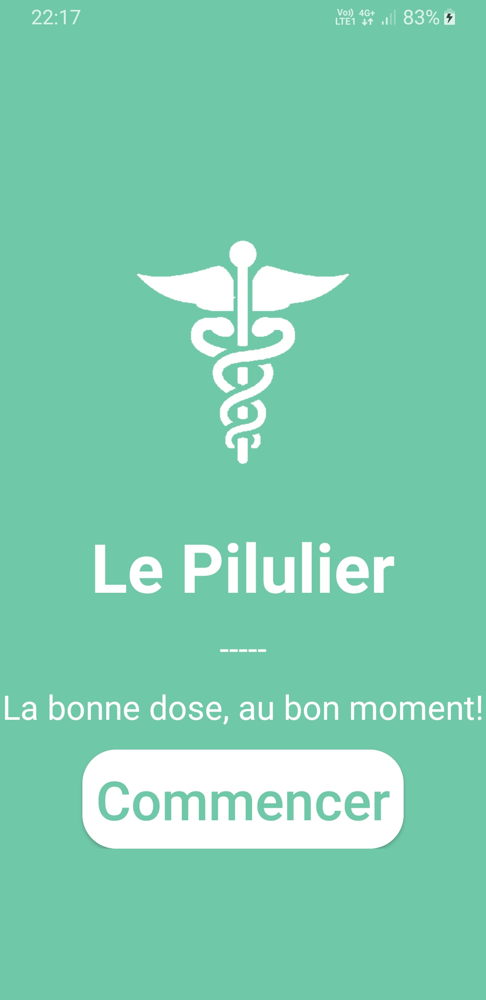
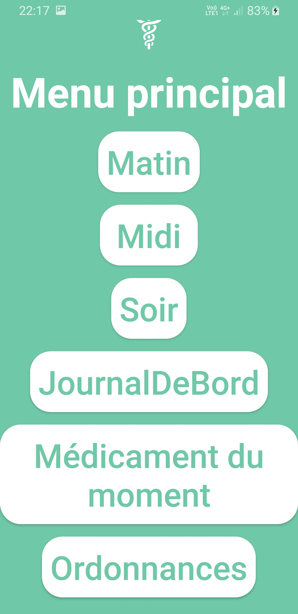

# Le pilulier

<!-- ABOUT THE PROJECT -->

<!-- PROJECT LOGO -->
 

  

  <h2 align="center">Le pilulier</h2>

  

    Le pilulier est une application simple de prise en main déstinée aux personnes âgées pour leur consommation de médicaments.
     
  

  * Depuis la page d'accueil vous pouvez consulter les différents moments (matin, midi, soir).  
  * La page "ordonnance" permet de saisir des médicaments provenant d'une ordonnance.  
  * La page "médicament du moment" affiche tous les médicaments à prendre en ce moment.  
  * La page "journal de bord" affiche une liste des médicaments non pris dans les jours précédents.  

    
    
  </a>

<!-- CONTRIBUTING -->
## Contribution
Toute contribution est la bienvenue. 

<!-- CONTACT -->
## Contacte
Si vous voulez me contacter [cliquez ici](mailto:afram.diril@edu.univ-paris13.fr)

Lien du projet : [https://github.com/iamafram/le-pilulier](https://github.com/iamafram/le-pilulier)

<!-- LICENSE -->
## License
[GNU](https://github.com/iamafram/le-pilulier/blob/master/LICENSE)